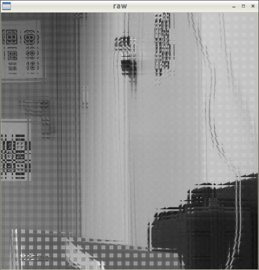
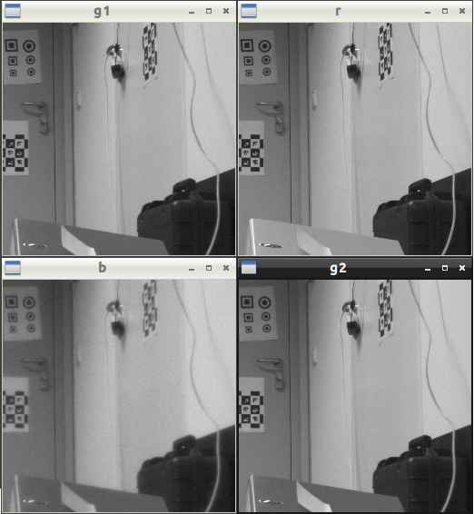
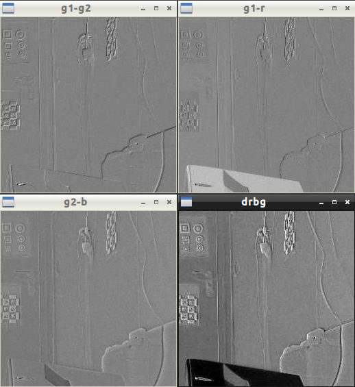
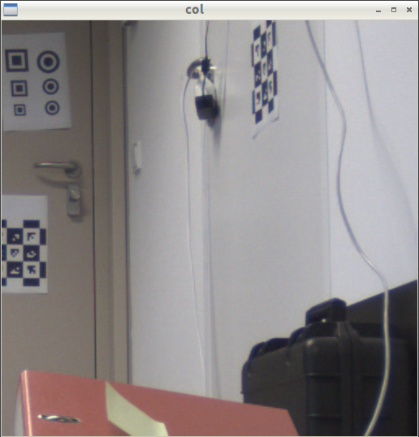
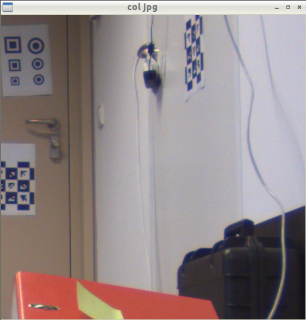
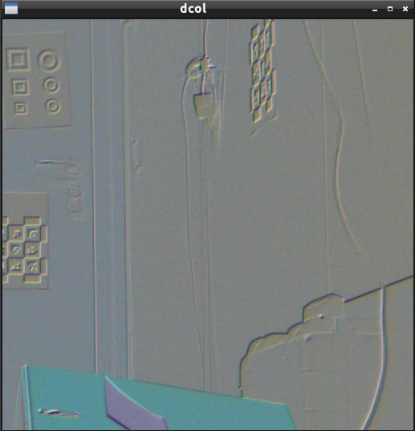
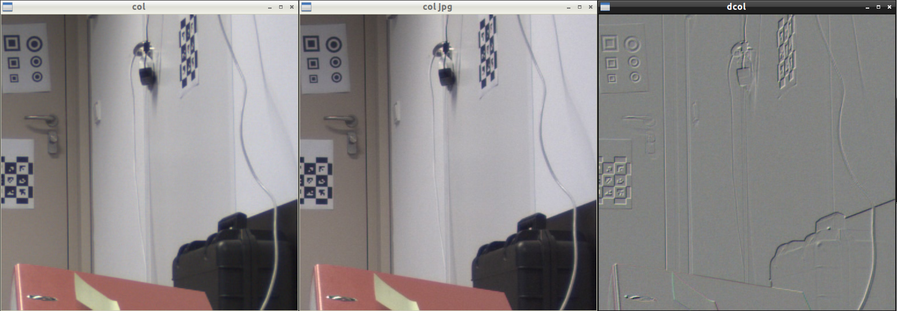
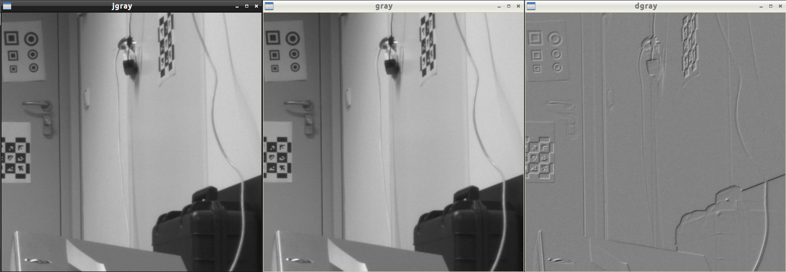
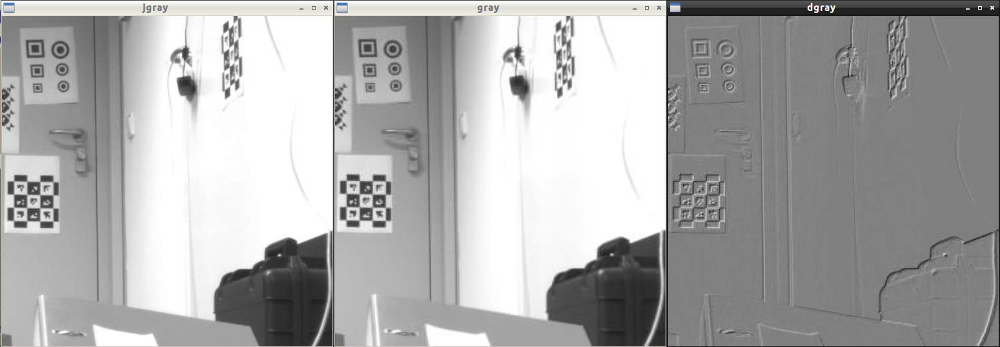

# elphel jp46 stereo tests

In order to optimize image quality and minimize artefacts, I have been looking into the JP4 mode(s) of our Elphel stereo camera (an Elphel Model 353 Camera, release 8.2.15 with two MT9P001 sensors). The Elphel Wiki pages are quite informative at a higher level (cf. [Elphel JP4 Wiki page](http://wiki.elphel.com/index.php?title=JP4), but the necessary information is spread over several pages and the details are only in the source code. A few more helpful links:

* Color processing demo: http://community.elphel.com/jp4/jp4demo.php 
* MT9P001 data sheet https://www.aptina.com/products/image_sensors/mt9p001i12stc/

As a result, I created a small test program with OpenCV that reads in a jp46 file and optionally compares it with a standard jpeg-compressed file of the same scene via absolute differences.


## OpenCV example code

The [code/](code/) directory contains a small cmake project with a cpp file that loads jp46 files into OpenCV 3.0. A helper class lets you either split a jp4 file into it's components or convert it to Bayer format that can be converted to RGB(or rather BGR really) with the standard OpenCV functions ( cvtCVolor() ). 

## Input data
The [data/](data/) folder contains a the input images that I used for testing showing an office scene with a number of test targets based on the CALTag library and some inspired by the QR code corner markers. In the following, we're working with a constant region of interest that I picked out of the original images (top left being at the beginning  macro-block and a size that is a multiple of 16 as well, of course).

I have tried to capture the jpeg/jp4 image pairs with as little delay as possible to minimize external influences (sunlight), so this should not affect the following analysis (exposure times barely differ).

The raw image data looks like this:



Separating the components to one matrix each looks like this:



Note the increased noise level in the blue channel. Will need to further look into this.

The component planes are useful in themselves, as the pixels are in a different physical place on chip, they
let us quickly create edge images by computing difference images:




### Color conversion
the JP4 matrix can be converted back to a Bayer-encoded version that OpenCV can handle.
The components converted to Bayer coding and then to color:



Comparing this to the reference jpeg (and looking at the differences), we see major differences:





Seems the gamma curve was set to 2.0 which is used in color mode, but bypassed in JP46 processing.


### Second round of comparisons - gamma set to 1.0

For a better comparison, I reset gamma to 1.0 and took another pair of images, the color version now looks very much like the JP4 one
(JP4 left, reference in the middle, difference right):



Converted to grayscale yields the following difference image (reference left, JP4 middle, difference right):



Interestingly, there are still considerable differences between the normal JPEG and JP4versions which I can't explain from exposure or color balance settings,
will need to check the encoding pipeline.

### Saving space: reducing JPEG quality

Next, I had a look at the effects of the JPEG encoder on our targets: Up to now we had been using 95% JPEG encoding quality, so I slightly
lowered it to 75% which should result in little visible artefacts (so the graphics designers say...)

The following image shows the JP4 image on the left ("gray"), the reference image on the right ("jgray"), both converted to grayscale. The JPEG image shows less noise in the white areas
around the markers. Further investigations will show if this is coming from the JPEG encoding of the JP4 images or from other sources.


Also JP4 files tend to be larger than jpegs at the same compression ratio:

```sh
-rw-r--r--@ 1 simon  staff  2490243 May 20 10:55 elphelimg_2486579.jp46.jpg
-rw-r--r--@ 1 simon  staff  1702233 May 20 10:55 elphelimg_1692231.jpeg
```

Originally I thought it is compressing with 100% quality, but setting the compression ratio to 60% yields smaller JP4 files as well:

```sh
-rw-r--r--@ 1 simon  staff   573938 May 20 14:20 elphelimg_q60.jp46.jpg
-rw-r--r--@ 1 simon  staff   402342 May 20 14:20 elphelimg_q60.jpeg
```

And as expected,artifacts and differences increase:




Will need to dig through the FPGA logic to get the hang of this...

### references

* CALTag: https://www.cs.ubc.ca/labs/imager/tr/2010/Atcheson_VMV2010_CALTag/
* QR code: ISO/IEC 18004, p.ex.  http://www.swisseduc.ch/informatik/theoretische_informatik/qr_codes/docs/qr_standard.pdf
* VoXel - for your systems engineering tasks: http://www.voxel.at/ 
